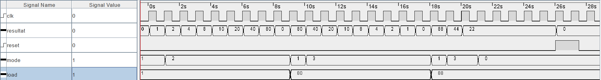

# SYL_Labo3

## Questions

### Question 1
#### Que se passerait-il si l'entrée clk_i d'un des composants n'était pas reliée au signal d'horloge?

Sa sortie ne sera jamais active et donc le résultat aura toujours un bit à 0 à cette position. Le décalage ne fonctionnera donc pas.

### Question 2
#### Si l'on charge la valeur `0b0110` dans le registre et que l'on effectue un décalage de 2 bits vers la droite, puis un décalage de 3 bits vers la gauche, quelle valeur va-t-on obtenir en sortie? Démontrez les étapes pour obtenir votre résultat.

Nous obtenons la valeur `0b1000`.
- LOAD `0110`
- Shift right `0011`
- Shift right `0001`
- Shift left `0010`
- Shift left `0100`
- Shift left `1000`

### Question 3
#### Mettez en évidence les différentes étapes ci-dessus dans votre chronogramme.

Dans l'image au dessus nous voyons les 5 étapes importantes entourées de rectangles rouge.
- Le premier rectangle représente le décalage du bit vers la gauche jusqu'au bout.
  Le résultat passe à 0 quand le bit sort du résultat.
- Le deuxième rectangle représente le décalage du bit vers la droite jusqu'au bout.
  Le résultat passe aussi à 0 quand le bit sort du résultat.
- Le troisième rectangle représente le décalage des deux bits de 2 pas vers la droite.
Avant chacun de ces trois rectangles nous faisons le `LOAD` de la valeur nécessaire.
- Le quatrième rectangle représente le `HOLD` maintenant la même valeur à la sortie.
- Le dernier rectangle représente le reset asynchrone.

### Question 4
#### Votre circuit a-t-il le comportement attendu? Argumentez et développez votre réponse.

Oui le circuit a un comportement attendu.

Au vu de la question, on veut savoir si c'est normal que le bit "disparaisse" quand il arrive au bout de la représentation. Ceci est normal car le but du circuit et simplement de déplacer les bits visuels de côté et pas de faire quelque chose de cyclique.

Si nous avions décider de faire que le circuit fasse revenir par là droite un bit sortant à gauche, nous aurions dû faire beaucoup de changements pour implémenter le registre à 8 bits en utilisant le registre à 4 bits.

### Question 5
#### Avec une fréquence d'horloge `clk_i` de 30MHz, calculez le nombre de cycle à atte de cycles visé en fonction de la fréquence et l'équivalence encodée au format hexadécimal sur 28 bits `0xffffffff`.

### Question 6
#### Démontrez que le fonctionnement attendu est conforme en mettant en évidence les différents états sur votre chronogramme. Développez et argumentez votre réponse.
