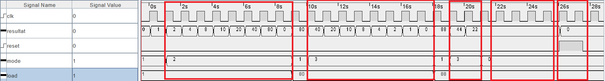
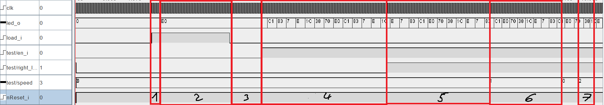
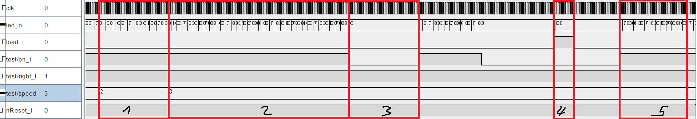
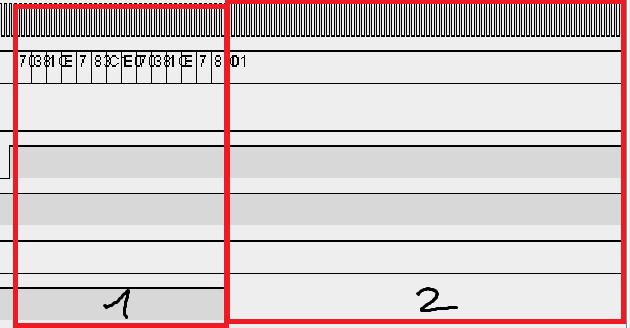

# SYL_Labo3

## Questions

### Question 1
#### Que se passerait-il si l'entrée clk_i d'un des composants n'était pas reliée au signal d'horloge?

Sa sortie ne sera jamais active et donc le résultat aura toujours un bit à 0 à cette position. Le décalage ne fonctionnera donc pas.

### Question 2
#### Si l'on charge la valeur `0b0110` dans le registre et que l'on effectue un décalage de 2 bits vers la droite, puis un décalage de 3 bits vers la gauche, quelle valeur va-t-on obtenir en sortie? Démontrez les étapes pour obtenir votre résultat.

Nous obtenons la valeur `0b1000`.
- LOAD `0110`
- Shift right `0011`
- Shift right `0001`
- Shift left `0010`
- Shift left `0100`
- Shift left `1000`

### Question 3
#### Mettez en évidence les différentes étapes ci-dessus dans votre chronogramme.

Dans l'image au dessus nous voyons les 5 étapes importantes entourées de rectangles rouge.
- Le premier rectangle représente le décalage du bit vers la gauche jusqu'au bout.
  Le résultat passe à 0 quand le bit sort du résultat.
- Le deuxième rectangle représente le décalage du bit vers la droite jusqu'au bout.
  Le résultat passe aussi à 0 quand le bit sort du résultat.
- Le troisième rectangle représente le décalage des deux bits de 2 pas vers la droite.
Avant chacun de ces trois rectangles nous faisons le `LOAD` de la valeur nécessaire.
- Le quatrième rectangle représente le `HOLD` maintenant la même valeur à la sortie.
- Le dernier rectangle représente le reset asynchrone.

### Question 4
#### Votre circuit a-t-il le comportement attendu? Argumentez et développez votre réponse.

Oui le circuit a un comportement attendu.

Au vu de la question, on veut savoir si c'est normal que le bit "disparaisse" quand il arrive au bout de la représentation. Ceci est normal car le but du circuit et simplement de déplacer les bits visuels de côté et pas de faire quelque chose de cyclique.

Si nous avions décider de faire que le circuit fasse revenir par là droite un bit sortant à gauche, nous aurions dû faire beaucoup de changements pour implémenter le registre à 8 bits en utilisant le registre à 4 bits.

### Question 5
#### Avec une fréquence d'horloge `clk_i` de 30MHz, calculez le nombre de cycle à attendre pour qu'il corresponde à une fréquence de 4, 2, 1 et 0.5Hz et complétez le tableau ci-dessous avec le nombre de cycles visé en fonction de la fréquence et l'équivalence encodée au format hexadécimal sur 28 bits `0xfffffff`.

|Fréquence visée|Nombres de cycle|Equivalence 28bits hexadécimal|
|---------------|----------------|------------------------------|
|4.0Hz          |7'500'000		 |0x07270E0						|
|2.0Hz          |15'000'000		 |0x0E4E1C0						|
|1.0Hz          |30'000'000		 |0x1C9C380						|
|0.5Hz          |60'000'000		 |0x3938700						|

### Question 6
#### Démontrez que le fonctionnement attendu est conforme en mettant en évidence les différents états sur votre chronogramme. Développez et argumentez votre réponse.

Dû à la limitation de performance du logiciel Logisim, nous avons dû mettre des valeurs différentes pour les fréquences de l'horloge et du chenillard pour avoir une représentation utilisable.

De plus, dans cette exemple, la valeur du `speed` sur deux bits est inversé. Dans le vrai circuit, plus la valeur `speed` est élevée plus le chenillard est lent. Dans cette exemple c'est donc en augmentant la valeur `speed` que nous augmentons réellement la vitesse de défilement du chenillard.

- Sur cette première partie du chronogramme nous pouvons voir dans le premier rectangle rouge, le délai entre l'activation de l'entrée `load_i` et le load réel sur les LEDs. Ceci nous montre que c'est une opération synchrone.
- Dans le deuxième rectangle nous voyons qu'après le load le chenillard maintien simplement la valeur sur les LEDs.
- Le troisième rectangle nous présente le miantient de la valeur affichée même lorsque nous enlevons l'entrée `load_i`.
- Le quatrième rectangle met en évidence le départ du chenillard avec l'allumage de l'entrée `en_i`. Nous voyons que la valeur des LEDs commence à circuler vers la gauche.
- Le cinquième rectangle représente le changement de sens de circulation quand on active l'entrée `right_nleft_i`.
- Le sixième rectangle nous montre l'augmentation de vitesse quand on passe l'entrée speed de `00` à `01`. Nous n'avons donc pas besoin d'arrêter le chenillard pour adapter sa vitesse. Le changement est visible par le temps que passe la sortie LED dans chaque état (moins de temps veut dire plus rapide).
- Le septième rectangle mets simplement la vitesse à `10` est donc diminue encore plus le temps passé dans chaque état.

Il est important de noter que la vitesse de l'horloge `clk` ne varie jamais.

- Cette deuxième partie reprend directement après la fin de la partie précédente et nous montre avec le premier rectangle la vitesse à `10`.
- Le deuxième rectangle nous montre l'augmentation dun e la vitesse à la vitesse maximale de `11`.
- Le troisième rectangle nous montre qu'en retirant l'entrée `en_i` le chenillard s'arrête et maintien la valeur actuel.
- Le quatrième rectangle nous montre le chargement d'une valeur par dessus une autre. L'état initial de la sortie n'est pas important pour un nouveau `load`.
- Le cinquième rectangle nous montre la reprise du chenillard à zéro mais avec une vitesse élevée dès le début.

- Le premier rectangle de cette dernière partie nous montre le fonctionnement standard du chenillard.
- Le deuxième et dernier rectangle nous montre la mise à zéro de la sortie avec l'activation de l'entrée `reset_i`.
